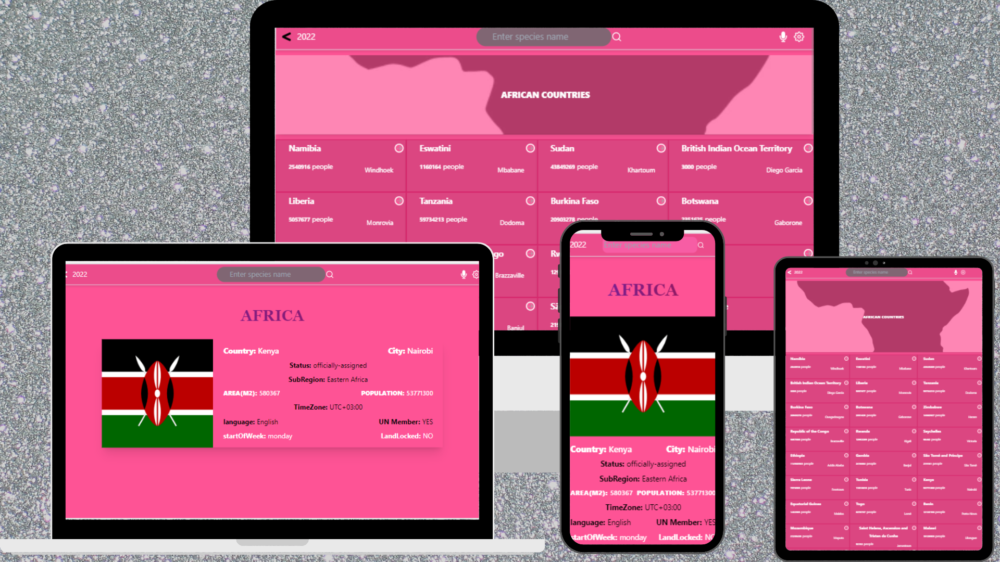

# Explore-African-Countries-project
Explore-african-countries-project is a web application that fetches data for all countries in africa from an API  and display in the UI. user can search a country using the search box. when you click one country you will be navigated to a page with the details of that country.


## Screenshot


## Live Presentation

[Explore-African-Countries](https://www.loom.com/share/6f39e75b7f074c4d8390fe79d6488700)

## Demo

[Explore-African-Countries](https://explore-africa-loman.netlify.app/)


## Run Locally

Clone the project

```bash
  git clone git@github.com:Josphat205/explore-african-countries-project.git
```

Go to the project directory

```bash
  cd explore-african-countries-project
```

Install dependencies

```bash
  npm install
```

Start the server

```bash
  npx eslint . --fix
  npm run start
```


## Josphat Kiploman

- [@Github](https://github.com/Josphat205)

- [@Linkedin](https://www.linkedin.com/in/josphat-kiploman-797430236/)


## 🤝 Contributing

Contributions, issues, and feature requests are welcome!

## Show your support

Give a ⭐ if you like this project!

## 📝 License

This project is [MIT](./MIT.md) licensed.
